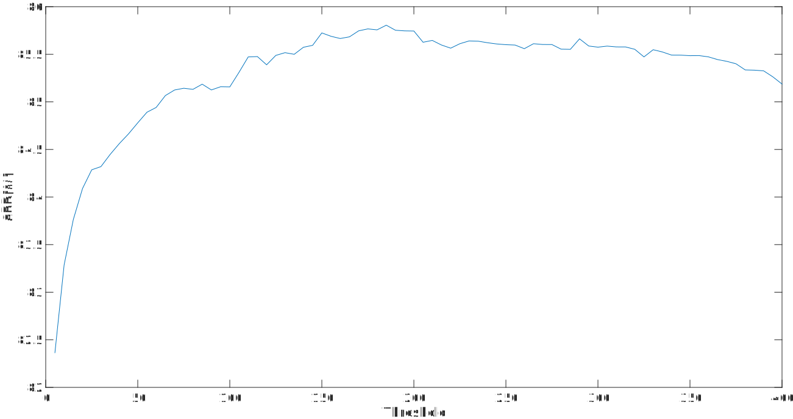

# Ultimate Leveling Based on Mumford-Shah Energy Functional Applied to Plant Detection

This repository contains the source code and executable rotines to test our implementation in plant bounding box detection task applied in Minervi [1] [Plant Dataset](https://www.plant-phenotyping.org/datasets-overview). By the way, this work was presented in [CIARP-2017](https://www.ciarp2017.org/) and published in Lecture Notes in Computer Science.


## What do we need to start?

Some softwares and libraries used here are listed bellow:

```
eclipse >= Kepler
jdk >= 1.7
matlab >= r2014b
imageJ >= 1.50i (to attend the user)
mmlib4j >= 1.0 (provided in this repository)
```

## Folders structure

The project was developed using Eclipse IDE, so the structure was adapted to port the [matlab evaluation tool](https://www.plant-phenotyping.org/lw_resource/datapool/_items/item_464/evaluationsuite_v0.2.zip) provided by Minervi [1].

```
src -> *.java files
bin -> *.class files
datasets -> folder to put plant dataset
evaluation -> folder to save results using the matlab evaluation tool
experiments -> contains extracted dataset by call: extractdataset.m (you can choose this path)
libraries -> mmlib4j-api-1.1.jar
matlab -> all matlab implementations of the matlab evaluation tool
means -> a folder to save extracted means of multiple tests to draw a robustness graph
results -> contains all results (you can choose this path)
others -> somethings to attend this readme.md file
```

## Using the codes

We divide the necessary to use this work in two categories.

### Matlab evaluation tool

The Matlab evaluation tool was developed by Minervi [1] and it can be downloaded [here](https://www.plant-phenotyping.org/lw_resource/datapool/_items/item_464/evaluationsuite_v0.2.zip).

#### Extract dataset

First of all, you need to download the Plant Dataset [here](https://www.plant-phenotyping.org/datasets-download). After, you extract the content in [datasets folder](https://github.com/gobber/CIARP/tree/master/datasets). Thus, the [datasets folder](https://github.com/gobber/CIARP/tree/master/datasets) directory tree should be as follow:

```
datasets
│
└─── Plant_Phenotyping_Datasets
	│
	└─── Plant
	│
	└─── Stacks
	│
	└─── Tray
```

Now it needs to run the matlab function `extractdataset.m`. Then, open matlab and navigate until our root directory, after, write as follows: 

```Matlab
cd matlab/
extractdataset(1,'../datasets/Plant_Phenotyping_Datasets/','../experiments/')
```

Inside [experiments folder](https://github.com/gobber/CIARP/tree/master/experiments) the directory tree should be as follows:

```
experiments
│
└─── Ara2012
│
└─── Ara2013-Canon
│
└─── Ara2013-RPi
```

#### Evaluate the method

This section is used after you extracted the dataset and made some tests using our Java implementation. Thus, after you get your results (one or more), you will see the directory tree as follows:

```
results
│
└─── MumfordShah
	│
	└─── result-1(filter=190)
	│
	└─── ...
```

Note that, in `result-1(filter=190)`, the number `1` is about the result and `(filter=190)` is about the energy filter. Finally, you can evaluate your results using the matlab evaluate tool, then open matlab and navigate until our root directory, after, write as follows:

```Matlab
cd matlab/
Evaluate_Task(1,'../experiments/','../results/MumfordShah/result-1(filter=190)/','../evaluation/',0);
``` 

Observation: In case of you run more than one test, you will have more than one result in `results/MumfordShah` folder, so you must call `Evaluate_Task` passing the last argument as `1`, because this is the option of "evaluate multiple experiments". 

### Java implementations

Our Java implementations is based on mmlib4j that is a morphological image library for Java. It was developed by Wonder Alexandre Luz Alves, and you can download the complete source [here](https://github.com/wonderalexandre/mmlib4j). More specifically, the codes about the functional attribute [2] are in a branch called [mumford-shah](https://github.com/wonderalexandre/mmlib4j/tree/mumford-shah). All you need to call the solution is in the [Main file](https://github.com/gobber/CIARP/blob/master/src/Main.java).

#### Parameters

There are nine parameters you can set.

| Parameter | Type     | Default                                        | Description                                             |
| --------- | -------  | ---------------------------------------------- | ------------------------------------------------------  |
| `distances` | Key:int  | Ara2012:250,Ara2013-Canon:250,Ara2013-RPi:100  | Values of distances to post processing of each dataset. Those values are used to merge incomplete regions. Pay attention you need to use comma separator between the values. |
| `datasets`  | Key:String | Ara2012,Ara2013-Canon,Ara2013-RPi | Sub-bases that you want to run our approach. Note that, if you choose one subbase, but note a distance value, it will be set as default. Pay attention you need to use comma separator between the values. |
| `saveImageResult` | boolean | false | Save the binary image result in `saveResultsPath`. |
| `saveImageBounds` | boolean | false | Save image with bounding boxes in `saveResultsPath`. |
| `debug` | boolean | true | Shows in terminal informations about the processing. |
| `inputPath` | String | /experiments/Plant_detection_localization/ | It is the path that contains the datasets Ara2012, Ara2013-Canon and Ara2013-RPi. |
| `saveResultsPath` | String | /results/MumfordShah/ | It is the path that the program saves the results (a csv file for each dataset image with the bounding boxes). |
| `rgbFilter` | double | 100 | It is the threshold value of the rgb classifier (a kind of knn classifier). | 
| `energyFilter` | int\|Key:int | 190 | It is the threshold value of the funcional atribute. Pay attention you need to use comma separator between the values when you set more than one energy value. |
| `areaFilter` | int | 190 | It is the threshold value of the area filter. |

Observations: The `inputPath` and the `saveResultsPath` are relatives paths, it means that all project works inside the CIARP folder, so you can [download this repository](https://github.com/gobber/CIARP/archive/master.zip). After you extracted the content you will see a folder called CIARP-master, remove the -master, so you can run the [Main file](https://github.com/gobber/CIARP/blob/master/src/Main.java) (see line number 64 to understand this strategy). The filters: `rgbFilter`, `energyFilter` and `areaFilter` are internally configured to work in our strategy, but you can download mmlib4j in branch [mumford-shah](https://github.com/wonderalexandre/mmlib4j/tree/mumford-shah) and customize it as you want.

#### How to set the parameters?

The implementation is terminal-based. All you need to do is call the [Main.class](https://github.com/gobber/CIARP/blob/master/bin/Main.class) using your OS terminal or Eclipse VM arguments. For example, a shell Linux call with all parameters set to default:

```
$ cd bin
$ java -cp .:../libraries/* -Xms4096m -Xmx8000m Main
```

Other shell Linux call, but now it sets `-Ddegub=false` and `-Ddatasets=Ara2012`: 

```
$ cd bin
$ java -cp .:../libraries/* -Xms4096m -Xmx8000m -Ddebug=false -Ddatasets=Ara2012 Main
```

Pay attention if you are in Windows terminal the path delimiter is `;` and not `:`. Note that, we call `-Xms4096m -Xmx8000m` because the images are big and usually Java needs extra memory to process it.

#### Energy robustness graph

This section is exclusively to output obtained by "evaluate multiple experiments", because this only makes sense if you have more than one result. Thus, in source there is a class called [ExtractMeans.java](https://github.com/gobber/CIARP/blob/master/src/utils/ExtractMeans.java), and it generate a .csv file with the mean values (SBD measurement) of each output from "evaluate multiple experiments". It is possible to set some paramaters to call [ExtractMeans](https://github.com/gobber/CIARP/blob/master/bin/utils/ExtractMeans.class) class.

| Parameter | Type     | Default                                        | Description                                             |
| --------- | -------  | ---------------------------------------------- | ------------------------------------------------------  |
| `inputPath` | String | /evaluation/Plant_detection_localization/ | Path with the output obtained by "evaluate multiple experiments" |
| `outputPath` | String | /means/ | Path when the means will be saved as a cvs file |
| `fileName` | String | means | Name of the means csv file |

Following the same idea of **How to set the parameters?** All you need to do is call the [ExtractMeans.class](https://github.com/gobber/CIARP/blob/master/bin/utils/ExtractMeans.class) using your OS terminal or Eclipse VM arguments. For example, a shell Linux call with all parameters set to default: 

```
$ cd bin
$ java utils.ExtractMeans
```

## Results

We found good results, that are sumarized in table bellow:


| Base 		 | SBD [\%] 	   | DiC  	| \|DiC\|  | 
| -------- 	 | ---- 	  | -------- | ----------- |
| Ara2012        | 92.0 (+/- 2.8) | 0.2 (+/-0.4)   | 0.2 (+/- 0.4) | 
| Ara2013-Canon  | 87.5 (+/- 2.7) | -0.1 (+/- 0.5) | 0.3 (+/- 0.5) |
| Ara2013-RPi 	 | 80.3 (+/- 3.9) | 0.1 (+/- 0.8)  | 0.4 (+/- 0.6) |
| all		 | 85.8 (+/- 5.7) | 0.0 (+/- 0.6)  | 0.3 (+/- 0.5) |

An energy robustness graph is provided bellow, in this case we varied the energy threshold in {0,...,400}, where give two index *i* and *j*, if *i* < *j* then *j* = *i*+5:



## References

[1] M. Minervini, A. Fischbach, H. Scharr, S. A. Tsaftaris, Finely-grained annotated datasets for image-based plant phenotyping, Pattern Recognition Letters 81 (2016) 80 – 89.

[2] Y. Xu, T. Graud, L. Najman, Hierarchical image simplification and segmentation based on Mumford-Shah-salient level line selection, Pattern Recognition Letters 83, Part 3 (2016) 278 – 286.

## Autors

The paper was produced by Charles Gobber, Wonder Alexandre Luz Alves and Ronaldo Fumio Hashimoto. This repository was created by Charles Gobber and you can send me a mail if you need something:

* **Charles Gobber** - charles26f@gmail.com
